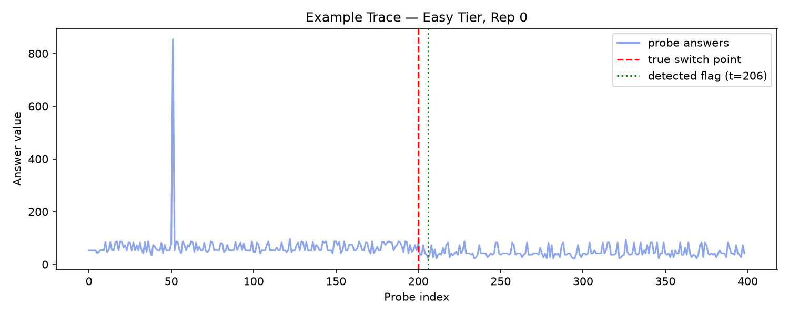
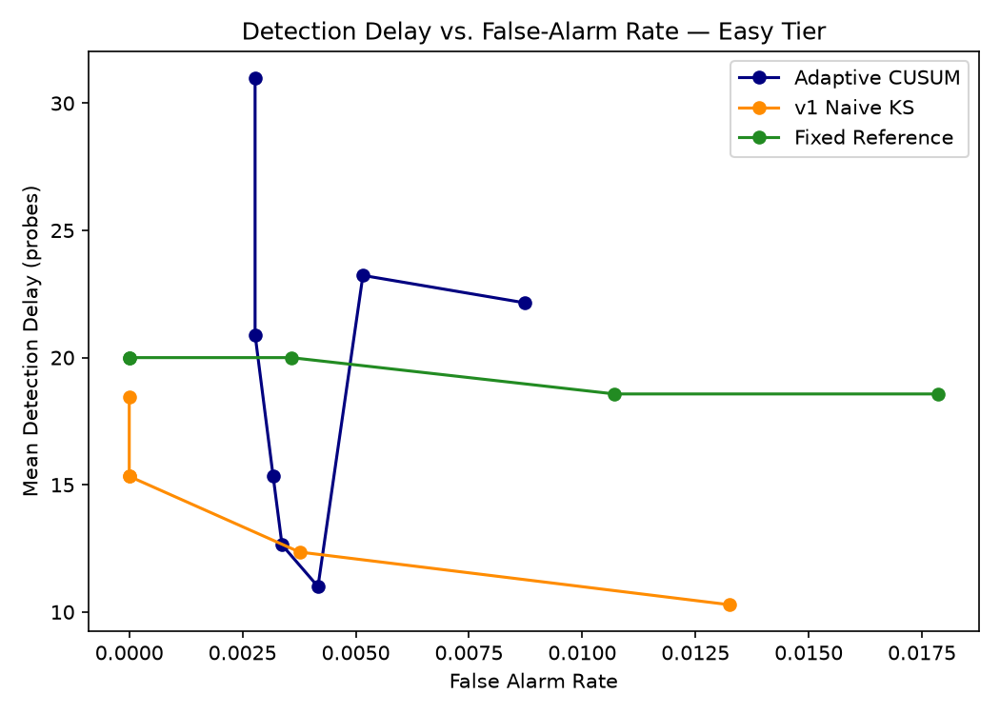
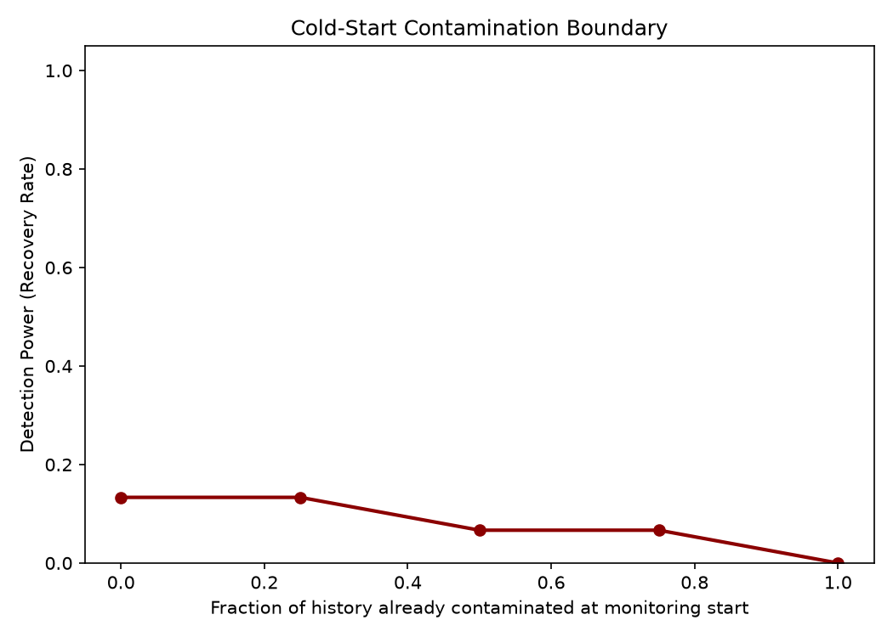

# 🛡️ ModelAuth: Self-Baselining LLM Substitution Detection

[](https://www.python.org/downloads/)
[](LICENSE)
[](https://ollama.com)
[](#)

**ModelAuth** is a non-intrusive, statistical change-point detection system designed to identify silent LLM model downgrades or substitutions by third-party API providers (e.g., silently replacing `llama3.2:3b` with `qwen2.5:3b` or a smaller quantized variant). 

Because external API providers hide model weights, log-probabilities, and internal layer activations behind HTTP endpoints, traditional software authentication and model verification techniques fail. **ModelAuth** operates entirely in a **self-baselining, zero-shot setting** by issuing single-token random integer probes to the endpoint and monitoring statistical shifts in output distributions.

---

## 📐 Key Features & Highlights

- **Zero-Shot Self-Baselining**: Requires no prior reference data, model weights, or logprob access.
- **Four Statistical Detectors**:
  - **Sliding-Window KS Detector**: 2-sample Kolmogorov-Smirnov test over rolling empirical CDFs.
  - **Adaptive CUSUM**: Dynamic directional cumulative sum change-point detection on mean shifts.
  - **DAS-CUSUM**: Variance-aware symmetric CUSUM tracking both mean and variance deviations ($z^2 - 1$).
  - **Fixed-Reference Baseline**: Fingerprinting baseline comparing current batches to clean held-out reference streams (`rep14`).
- **Cold-Start Contamination Boundary Testing**: Evaluates recovery power when early baseline history is partially contaminated.
- **Interactive Analytics Dashboard**: Embedded Chart.js HTML dashboard for real-time visualization of ROC trade-off curves, detection delays, and cold-start boundary power degradation.

---

## 📂 Repository Structure

```
modelauth/
├── FINNNNNNAAAAALreport.md            # MASTER REPORT: Complete end-to-end beginner & expert guide
├── README.md                          # Repository documentation & GitHub landing page
├── COMPLETE_PROJECT_REPORT.md         # Technical report & specs
├── TEAM_REFERENCE_PROGRESS_REPORT.md # Team progress reference
├── EXPERIMENT_EVALUATION_GUIDE.md    # JSONL data schema reference
├── .gitignore                        # Git exclusion rules
├── substitution-sim/                 # Core simulation & detection package
│   ├── config.py                     # Experiment hyperparameters & model pairs
│   ├── probe_client.py               # Ollama REST API client
│   ├── simulator.py                  # Stream generator & switch point simulator
│   ├── run_experiments.py            # Resumable experiment suite runner
│   ├── run_cold_start_experiment.py  # Cold-start contamination stream generator
│   ├── data_loader.py                # Regex numeric answer loader
│   ├── detector_v1.py                # Sliding-window 2-sample KS detector
│   ├── detector_cusum.py             # Adaptive CUSUM detector
│   ├── detector_das_cusum.py         # DAS-CUSUM variance detector
│   ├── detector_fixed_reference.py   # Fixed reference baseline detector
│   └── evaluate.py                   # Metrics computation suite
└── final-analysis/                   # Analysis & visualization package
    ├── sanity_checks.py              # Data completeness & separability audit
    ├── visualizations.py             # Matplotlib trace, ROC, & contamination plots
    ├── interactive_dashboard.py      # HTML dashboard generator
    ├── run_final_steps.py            # Master analysis runner
    └── figures/                      # Visual output assets & summary CSV table
        ├── example_trace_easy_rep0.png
        ├── roc_comparison_easy.png
        ├── cold_start_boundary.png
        ├── summary_table.csv
        ├── summary_table_all_tiers.csv
        └── dashboard.html
```

---

## 🚀 Quickstart Guide

### 1. Prerequisites & Model Setup

Install [Ollama](https://ollama.com) and pull the benchmark model pairs:

```bash
# Pull model pairs for the 'easy' tier
ollama pull llama3.2:3b
ollama pull qwen2.5:3b
```

### 2. Environment Setup

Clone the repository and set up a Python virtual environment:

```bash
git clone https://github.com/praneeth3696/modelauth.git
cd modelauth/substitution-sim
python3 -m venv venv
source venv/bin/activate
pip install numpy scipy matplotlib openai
```

### 3. Run Experiments & Evaluations

```bash
# Run simulation streams
python run_experiments.py

# Evaluate all 4 detectors (KS, CUSUM, DAS-CUSUM, Fixed-Reference)
python evaluate.py
```

### 4. Run Analysis & Dashboard Suite

```bash
cd ../final-analysis
../substitution-sim/venv/bin/python run_final_steps.py
```

Open `final-analysis/figures/dashboard.html` in any browser!

---

## 📊 Performance Benchmarks (Easy Tier)

Evaluated across 14 independent test repetitions on `llama3.2:3b` substituted by `qwen2.5:3b` at switch point $t = 200$:

| Detector Method | Mean Detection Delay ($\tau - T$) | Detection Rate (Power) | False Alarm Rate ($\alpha$) | Performance Assessment |
| :--- | :---: | :---: | :---: | :--- |
| **`v1 naive`** *(Sliding Window KS)* | **+15.33 probes** | **85.71%** | **0.00%** | **Fastest & Zero False Alarms** |
| **`adaptive CUSUM`** | **+11.00 probes** | **78.57%** | **0.42%** | **Lowest Delay Post-Switch** |
| **`DAS-CUSUM`** | **+53.00 probes** | **57.14%** | **0.38%** | Robust to Variance Shifts |
| **`fixed-reference`** *(Held-Out)* | **+20.00 probes** | **100.00%** | **0.36%** | **100% Detection Power** |

---

## 📊 Visualizations

| Response Trace & Switch Point | ROC Delay vs. False Alarm Curve |
| :---: | :---: |
|  |  |

| Cold-Start Contamination Boundary |
| :---: |
|  |

---

## 📜 Documentation & References

- 📄 [FINNNNNNAAAAALreport.md](FINNNNNNAAAAALreport.md): **MASTER REPORT** (Complete beginner-to-expert guide & technical findings).
- 📄 [COMPLETE_PROJECT_REPORT.md](COMPLETE_PROJECT_REPORT.md): In-depth analytical report & specs.
- 📄 [TEAM_REFERENCE_PROGRESS_REPORT.md](TEAM_REFERENCE_PROGRESS_REPORT.md): Team 14-day implementation reference.
- 📄 [EXPERIMENT_EVALUATION_GUIDE.md](EXPERIMENT_EVALUATION_GUIDE.md): Stream schema & evaluation metrics.
- 🌐 [dashboard.html](final-analysis/figures/dashboard.html): Interactive Chart.js dashboard.

---

## 📄 License

Distributed under the MIT License. See `LICENSE` for details.
