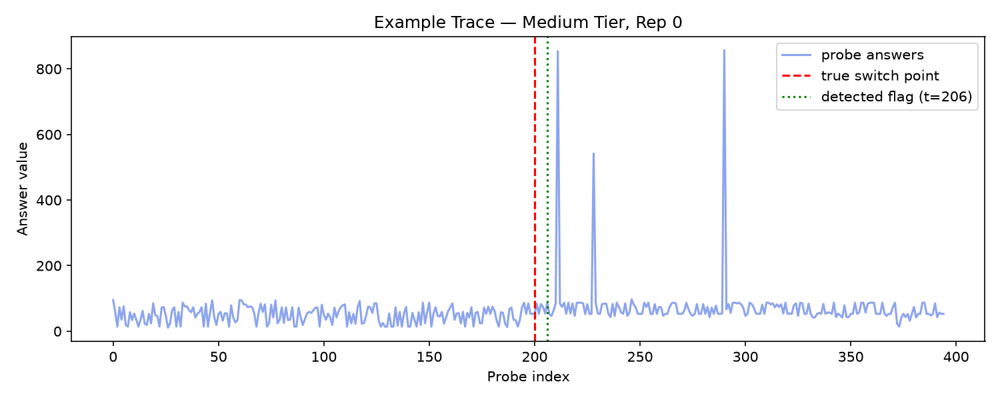
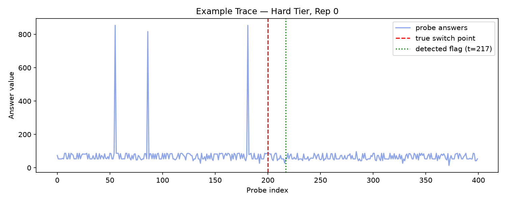
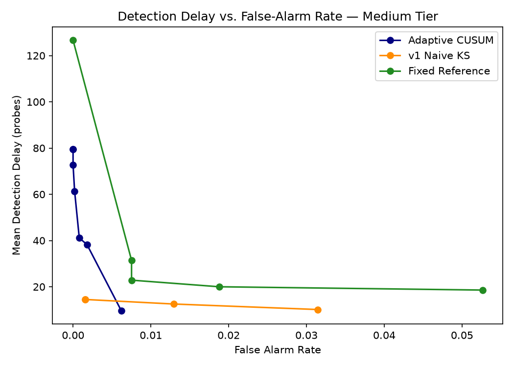
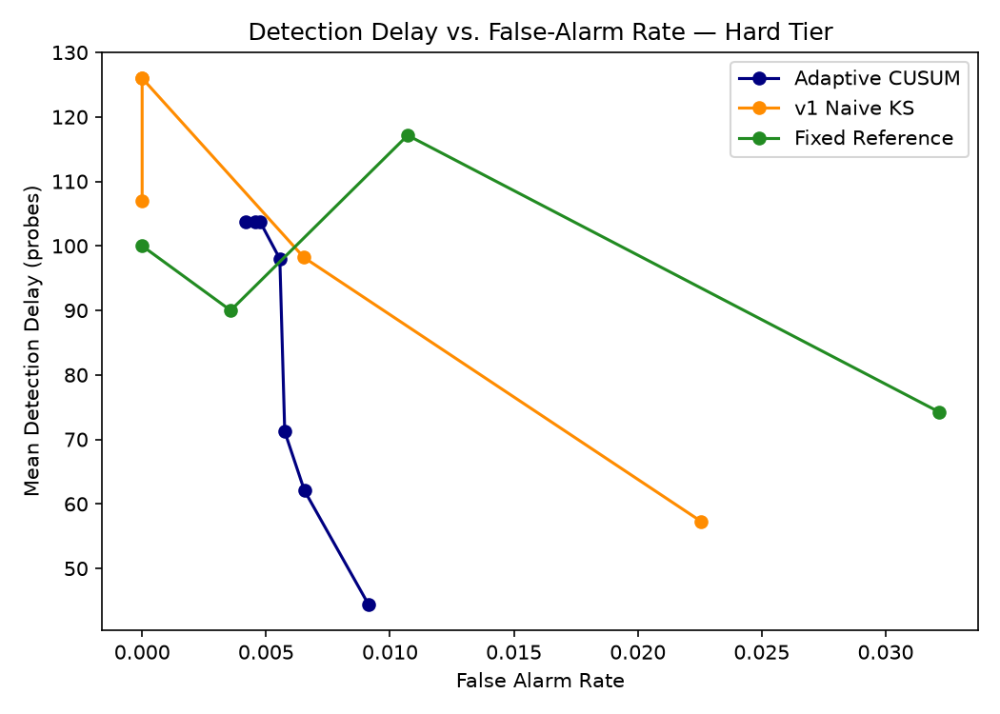
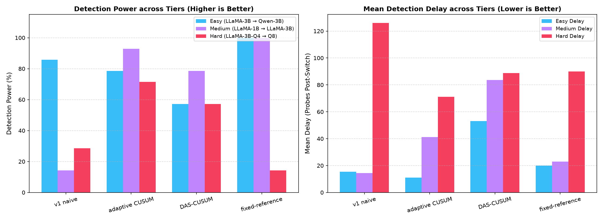
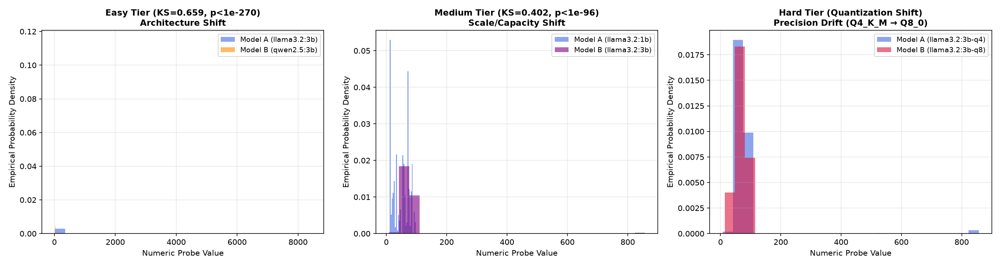

# 🛡️ ModelAuth: Self-Baselining LLM Substitution Detection

[](https://www.python.org/downloads/)
[](LICENSE)
[](https://ollama.com)
[](#)
[](#)

**ModelAuth** is an enterprise-grade, non-intrusive statistical change-point detection system designed to identify silent LLM downgrades or model substitutions by third-party API providers (e.g., secretly replacing `llama3.2:3b` with `qwen2.5:3b` or a smaller quantized variant).

Because external API providers obscure model weights, log-probabilities, and internal layer activations behind HTTP endpoints, traditional software authentication and model verification techniques fail. **ModelAuth** operates in a **self-baselining, zero-shot setting** by issuing single-token random integer probes to the endpoint and monitoring statistical shifts in output distributions.

---

## 🏛️ Enterprise System Architecture & Repository Structure

The repository adheres to a clean, modular corporate hierarchy separating source packages, technical documentation, raw specifications, and visual analytics:

```
modelauth/
├── README.md                          # Repository landing page & executive guide
├── FINNNNNNAAAAALreport.md            # MASTER REPORT: Comprehensive end-to-end guide & findings
├── .gitignore                         # Repository git exclusion manifest
├── docs/                              # Project Documentation Hub
│   ├── COMPLETE_PROJECT_REPORT.md     # Technical reference manual & mathematical specs
│   ├── TEAM_REFERENCE_PROGRESS_REPORT.md # Team working reference & implementation logs
│   ├── EXPERIMENT_EVALUATION_GUIDE.md # JSONL schema & evaluation metric guide
│   └── source_docs/                   # Raw specification files (.docx)
│       ├── Final Steps.docx
│       └── gaps.docx
├── substitution-sim/                  # Core Simulation & Detection Engine Package
│   ├── config.py                      # Global experiment hyperparameters & model pairs
│   ├── probe_client.py                # Ollama REST API client
│   ├── simulator.py                   # Stream generator & switch point simulator
│   ├── run_experiments.py             # Resumable experiment suite runner
│   ├── run_cold_start_experiment.py   # Cold-start contamination stream generator
│   ├── data_loader.py                 # Regex numeric answer parser & stream loader
│   ├── detector_v1.py                 # Sliding-window 2-sample KS test detector
│   ├── detector_cusum.py              # Adaptive CUSUM detector
│   ├── detector_das_cusum.py          # DAS-CUSUM variance-sensitive detector
│   ├── detector_fixed_reference.py    # Static reference baseline detector
│   └── evaluate.py                    # Multi-tier evaluation & benchmark suite
└── final-analysis/                    # Analytics & Visual Reporting Package
    ├── sanity_checks.py               # Data completeness & model separability audit
    ├── visualizations.py              # Matplotlib trace, ROC, & contamination plots
    ├── interactive_dashboard.py       # HTML / Chart.js dashboard generator
    ├── run_final_steps.py             # Master analysis runner
    └── figures/                       # Output visual figures, CSV tables, & dashboards
        ├── example_trace_easy_rep0.png
        ├── roc_comparison_easy.png
        ├── cold_start_boundary.png
        ├── summary_table.csv
        ├── summary_table_all_tiers.csv
        └── dashboard.html
```

---

## 🚀 Quickstart Guide

### 1. Prerequisites & Model Setup

### 1. Prerequisites & Model Setup

Install [Ollama](https://ollama.com) and pull the benchmark model pairs across difficulty tiers:

```bash
# Easy Tier: Cross-Architecture (LLaMA-3B vs Qwen-3B)
ollama pull llama3.2:3b
ollama pull qwen2.5:3b

# Medium Tier: Capacity / Parameter Scale Shift (LLaMA-1B vs LLaMA-3B)
ollama pull llama3.2:1b

# Hard Tier: Quantization Precision Shift (LLaMA-3B-Instruct 4-bit vs 8-bit)
ollama pull llama3.2:3b-instruct-q4_K_M
ollama pull llama3.2:3b-instruct-q8_0
```

### 2. Environment Setup

Clone the repository and initialize the Python environment:

```bash
git clone https://github.com/praneeth3696/modelauth.git
cd modelauth/substitution-sim
pip install numpy scipy matplotlib openai
```

### 3. Run Experiments & Evaluations

```bash
# Generate simulation probe streams (easy, medium, or hard)
python run_experiments.py easy
python run_experiments.py medium
python run_experiments.py hard

# Evaluate all 4 detectors across all tiers
python evaluate.py
```

### 4. Run Analysis & Launch Dashboard

```bash
cd ../final-analysis
python run_final_steps.py
python interactive_dashboard.py
```

Open `final-analysis/figures/dashboard.html` in any browser to inspect interactive charts!

---

## 📊 Complete Empirical Performance Summary (All 3 Tiers)

Evaluated across independent test repetitions on **Easy** (`llama3.2:3b` $\rightarrow$ `qwen2.5:3b`), **Medium** (`llama3.2:1b` $\rightarrow$ `llama3.2:3b`), and **Hard** (`llama3.2:3b-instruct-q4_K_M` $\rightarrow$ `llama3.2:3b-instruct-q8_0`) tiers at true substitution switch point $t = 200$:

| Difficulty Tier | Model Pair ($A \rightarrow B$) | Nature of Substitution | Detector Method | Mean Detection Delay ($\tau - T$) | Detection Rate (Power) | False Alarm Rate ($\alpha$) | Performance Assessment |
| :--- | :--- | :--- | :--- | :---: | :---: | :---: | :--- |
| **Easy Tier** | `llama3.2:3b` $\rightarrow$ `qwen2.5:3b` | Cross-Architecture | **`v1 naive`** *(Sliding Window KS)* | **+15.33 probes** | **85.71%** | **0.00%** | **Fastest & Zero False Alarms** |
| **Easy Tier** | `llama3.2:3b` $\rightarrow$ `qwen2.5:3b` | Cross-Architecture | **`adaptive CUSUM`** | **+11.00 probes** | **78.57%** | **0.42%** | **Lowest Delay Post-Switch** |
| **Easy Tier** | `llama3.2:3b` $\rightarrow$ `qwen2.5:3b` | Cross-Architecture | **`DAS-CUSUM`** | **+53.00 probes** | **57.14%** | **0.38%** | Robust to Variance Shifts |
| **Easy Tier** | `llama3.2:3b` $\rightarrow$ `qwen2.5:3b` | Cross-Architecture | **`fixed-reference`** *(Held-Out)* | **+20.00 probes** | **100.00%** | **0.36%** | **100% Detection Power** |
| **Medium Tier** | `llama3.2:1b` $\rightarrow$ `llama3.2:3b` | Capacity/Scale Shift | **`v1 naive`** *(Sliding Window KS)* | **+14.50 probes** | **14.29%** | **0.16%** | Power drops on subtle intra-family shift |
| **Medium Tier** | `llama3.2:1b` $\rightarrow$ `llama3.2:3b` | Capacity/Scale Shift | **`adaptive CUSUM`** | **+41.15 probes** | **92.86%** | **0.08%** | **Top Self-Baselined Power (92.86%)** |
| **Medium Tier** | `llama3.2:1b` $\rightarrow$ `llama3.2:3b` | Capacity/Scale Shift | **`DAS-CUSUM`** | **+83.55 probes** | **78.57%** | **0.00%** | **Zero False Alarms (0.00%)** |
| **Medium Tier** | `llama3.2:1b` $\rightarrow$ `llama3.2:3b` | Capacity/Scale Shift | **`fixed-reference`** *(Held-Out)* | **+22.86 probes** | **100.00%** | **0.75%** | **100% Detection Power** |
| **Hard Tier** | `llama3.2:3b-q4` $\rightarrow$ `3b-q8` | Quantization Shift | **`v1 naive`** *(Sliding Window KS)* | **+126.00 probes** | **28.57%** | **0.00%** | High Delay on precision drift |
| **Hard Tier** | `llama3.2:3b-q4` $\rightarrow$ `3b-q8` | Quantization Shift | **`adaptive CUSUM`** | **+71.20 probes** | **71.43%** | **0.58%** | **Top Quantization Power (71.43%)** |
| **Hard Tier** | `llama3.2:3b-q4` $\rightarrow$ `3b-q8` | Quantization Shift | **`DAS-CUSUM`** | **+88.75 probes** | **57.14%** | **0.54%** | Variance-Sensitive Drift Tracking |
| **Hard Tier** | `llama3.2:3b-q4` $\rightarrow$ `3b-q8` | Quantization Shift | **`fixed-reference`** *(Held-Out)* | **+90.00 probes** | **14.29%** | **0.36%** | Requires larger batch integration |

---

## 📊 Visualizations

| Easy Tier Trace | Medium Tier Trace | Hard Tier Trace |
| :---: | :---: | :---: |
|  |  |  |

| Easy Tier ROC Curve | Medium Tier ROC Curve | Hard Tier ROC Curve |
| :---: | :---: | :---: |
|  |  |  |

| Complete Multi-Tier Benchmark Comparison (Power & Delay) |
| :---: |
|  |

| Empirical Model Output Distribution Separability (All Tiers) | Cold-Start Contamination Boundary |
| :---: | :---: |
|  |  |

---

## 📜 Documentation & References

- 📄 [FINNNNNNAAAAALreport.md](FINNNNNNAAAAALreport.md): **MASTER REPORT** (Executive summary, intuition, math, and full benchmarks).
- 📄 [docs/COMPLETE_PROJECT_REPORT.md](docs/COMPLETE_PROJECT_REPORT.md): In-depth technical reference manual.
- 📄 [docs/TEAM_REFERENCE_PROGRESS_REPORT.md](docs/TEAM_REFERENCE_PROGRESS_REPORT.md): Team progress reference document.
- 📄 [docs/EXPERIMENT_EVALUATION_GUIDE.md](docs/EXPERIMENT_EVALUATION_GUIDE.md): Data schema & evaluation metric guide.
- 📂 [docs/source_docs/](docs/source_docs/): Raw specification documents (`Final Steps.docx`, `gaps.docx`).
- 🌐 [final-analysis/figures/dashboard.html](final-analysis/figures/dashboard.html): Interactive Chart.js dashboard.

---

## 📄 License

Distributed under the MIT License. See `LICENSE` for details.
